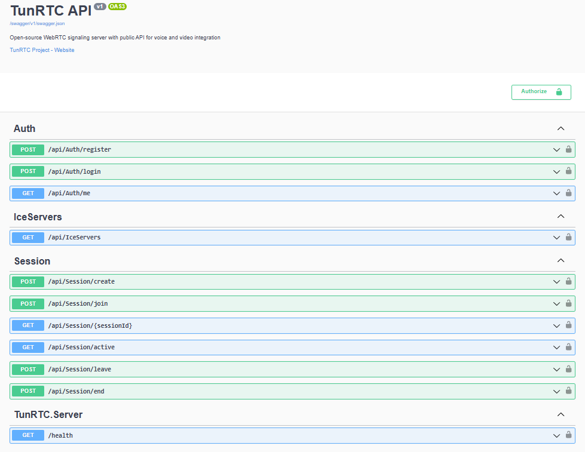

# 🚀 TunRTC - Open-Source WebRTC Signaling Server

<div align="center">

[](https://dotnet.microsoft.com/)
[](LICENSE)
[](https://learn.microsoft.com/aspnet/core/signalr/)
[](https://www.postgresql.org/)
[](https://www.docker.com/)

**Serveur de signalisation WebRTC auto-hébergé avec API publique complète**

Alternative open-source à Agora.io, Twilio Video, et autres services WebRTC propriétaires

<p align="center">
  
  
</p>

[🌐 Démo](http://localhost:5000/swagger) • [📖 Documentation](./Docs) • [🧪 Tests](./Tests) • [💻 SDKs](./SDKs)

</div>

---

## 📸 Captures d'écran

<div align="center">

### Server WPF


### Server Web


### SignalR WebSocket


### Swagger


</div>

---

## ✨ Fonctionnalités

- ✅ **Signaling Server** avec SignalR (WebSocket temps réel)
- ✅ **API REST** complète pour la gestion des sessions
- ✅ **Authentification JWT** sécurisée
- ✅ **Support STUN/TURN** via Coturn
- ✅ **Base de données PostgreSQL** avec Entity Framework Core
- ✅ **SDK JavaScript** prêt à l'emploi
- ✅ **SDK C#** pour applications .NET
- ✅ **Documentation Swagger** interactive
- ✅ **Scalabilité horizontale** (supporte 1000+ connexions simultanées)
- ✅ **Chat en temps réel**
- ✅ **Gestion des statuts** (mute, vidéo on/off)

---

## 🏗️ Architecture

```
┌─────────────────────────────────────────────────────────┐
│                     Client Apps                         │
│  (Web, Mobile, Desktop via SDK JS/C#)                   │
└───────────────────┬─────────────────────────────────────┘
                    │
        ┌───────────┼───────────┐
        │                       │
┌───────▼─────────┐   ┌────────▼────────┐
│   REST API      │   │  SignalR Hub    │
│  (ASP.NET Core) │   │   (WebSocket)   │
└───────┬─────────┘   └────────┬────────┘
        │                       │
        └───────────┬───────────┘
                    │
        ┌───────────▼───────────┐
        │   PostgreSQL Database │
        └───────────────────────┘
                    
        ┌───────────────────────┐
        │  Coturn (STUN/TURN)   │
        │   NAT Traversal       │
        └───────────────────────┘
```

---

## 🚀 Installation Rapide

### Prérequis

- .NET 8.0 SDK
- PostgreSQL 14+
- Coturn (optionnel mais recommandé)

### 1. Clone le Repository

```bash
git clone https://github.com/DeLTa-X-Tunisia/TunRTC.git
cd TunRTC
```

### 2. Configuration PostgreSQL

```bash
# Créer la base de données
createdb tunrtc

# Importer le schéma
psql -U postgres -d tunrtc -f PostgreSQL/schema.sql
```

Ou utilisez Entity Framework Migrations :

```bash
cd Server
dotnet ef database update
```

### 3. Configuration

Éditez `Server/appsettings.json` :

```json
{
  "ConnectionStrings": {
    "DefaultConnection": "Host=localhost;Database=tunrtc;Username=postgres;Password=your_password"
  },
  "Jwt": {
    "Key": "CHANGE_THIS_SECRET_KEY_IN_PRODUCTION",
    "Issuer": "TunRTC",
    "Audience": "TunRTC.Users",
    "ExpirationMinutes": 1440
  },
  "IceServers": {
    "StunServers": [
      "stun:stun.l.google.com:19302"
    ],
    "TurnServer": {
      "Enabled": true,
      "Urls": ["turn:YOUR_SERVER_IP:3478"],
      "Username": "tunrtc",
      "Credential": "tunrtc123"
    }
  }
}
```

### 4. Démarrer le Serveur

```bash
cd Server
dotnet run
```

Le serveur démarre sur : `https://localhost:7000`

Swagger UI : `https://localhost:7000`

### 5. Configuration Coturn (Optionnel)

```bash
# Installer Coturn
sudo apt-get install coturn

# Copier la configuration
sudo cp Coturn/config/turnserver.conf /etc/coturn/turnserver.conf

# Modifier l'IP externe
sudo nano /etc/coturn/turnserver.conf
# Remplacer YOUR_PUBLIC_IP par votre IP publique

# Démarrer Coturn
sudo systemctl enable coturn
sudo systemctl start coturn
```

---

## 📦 Utilisation des SDKs

### JavaScript SDK

```bash
cd ClientSDK/JS
npm install
```

```javascript
const client = new TunRTCClient({
    apiUrl: 'https://your-server.com/api',
    hubUrl: 'https://your-server.com/hubs/signaling'
});

// Login
await client.login('user@example.com', 'password');

// Create session
const session = await client.createSession('My Call', 10);

// Join session
await client.joinSession(session.sessionId, true, true);

// Handle streams
client.onLocalStream = (stream) => {
    document.getElementById('local-video').srcObject = stream;
};

client.onRemoteStream = (data) => {
    const video = document.createElement('video');
    video.srcObject = data.stream;
    document.body.appendChild(video);
};
```

[📖 Documentation complète JavaScript](ClientSDK/JS/README.md)

### C# SDK

```bash
dotnet add package TunRTC.Client
```

```csharp
var client = new TunRTCClient(
    "https://your-server.com/api",
    "https://your-server.com/hubs/signaling"
);

// Login
await client.LoginAsync("user@example.com", "password");

// Create session
var session = await client.CreateSessionAsync("My Call", 10);

// Join session
await client.JoinSessionAsync(session.SessionId);

// Handle events
client.OfferReceived += async (sender, data) => {
    // Handle WebRTC offer
};
```

[📖 Documentation complète C#](ClientSDK/CSharp/README.md)

---

## 📡 API Endpoints

### Authentication

- `POST /api/auth/register` - Register new user
- `POST /api/auth/login` - Login
- `GET /api/auth/me` - Get current user (JWT required)

### Sessions

- `POST /api/session/create` - Create session
- `POST /api/session/join` - Join session
- `GET /api/session/{sessionId}` - Get session details
- `GET /api/session/active` - List active sessions
- `POST /api/session/leave` - Leave session
- `POST /api/session/end` - End session (creator only)

### ICE Servers

- `GET /api/iceservers` - Get STUN/TURN configuration

### SignalR Hub

**Endpoint:** `/hubs/signaling`

**Methods:**
- `JoinSession(sessionId)` - Join session room
- `LeaveSession(sessionId)` - Leave session room
- `SendOffer(targetConnectionId, offer)` - Send WebRTC offer
- `SendAnswer(targetConnectionId, answer)` - Send WebRTC answer
- `SendIceCandidate(targetConnectionId, candidate)` - Send ICE candidate
- `UpdateStatus(sessionId, isMuted, isVideoEnabled)` - Update participant status
- `SendMessage(sessionId, message)` - Send chat message

**Events:**
- `ParticipantJoined` - New participant joined
- `ParticipantLeft` - Participant left
- `ReceiveOffer` - Incoming WebRTC offer
- `ReceiveAnswer` - Incoming WebRTC answer
- `ReceiveIceCandidate` - Incoming ICE candidate
- `ParticipantStatusChanged` - Status changed
- `ReceiveMessage` - Chat message

---

## 🔐 Sécurité

- ✅ **JWT Authentication** pour toutes les routes protégées
- ✅ **HTTPS obligatoire** en production
- ✅ **Password hashing** avec SHA256
- ✅ **CORS configuré** pour multi-domaines
- ✅ **Rate limiting** (à configurer selon besoins)

**⚠️ En production :**
1. Changez la clé JWT dans `appsettings.json`
2. Utilisez des certificats SSL valides
3. Changez les credentials TURN
4. Activez le rate limiting
5. Configurez un reverse proxy (nginx)

---

## 📊 Scalabilité

### Horizontal Scaling

Pour gérer 1000+ connexions simultanées :

1. **Redis Backplane** pour SignalR :
```csharp
services.AddSignalR().AddStackExchangeRedis("localhost:6379");
```

2. **Load Balancer** (nginx, HAProxy)
3. **Multiple server instances**
4. **Database connection pooling**

### Performance Tips

- Utilisez PostgreSQL en mode production
- Configurez les connection pools
- Activez le logging minimal en production
- Utilisez CDN pour les assets statiques

---

## 🐳 Docker Deployment

```yaml
version: '3.8'
services:
  tunrtc:
    image: tunrtc:latest
    ports:
      - "7000:80"
    environment:
      - ConnectionStrings__DefaultConnection=Host=db;Database=tunrtc;Username=postgres;Password=postgres
    depends_on:
      - db
      
  db:
    image: postgres:14
    environment:
      - POSTGRES_DB=tunrtc
      - POSTGRES_PASSWORD=postgres
    volumes:
      - postgres_data:/var/lib/postgresql/data
      
  coturn:
    image: coturn/coturn
    network_mode: host
    volumes:
      - ./Coturn/config/turnserver.conf:/etc/coturn/turnserver.conf

volumes:
  postgres_data:
```

---

## 📚 Documentation

- [📖 Guide d'intégration](Docs/INTEGRATION.md)
- [🔧 Configuration avancée](Docs/CONFIGURATION.md)
- [🚀 Déploiement en production](Docs/DEPLOYMENT.md)
- [🐛 Troubleshooting](Docs/TROUBLESHOOTING.md)
- [📡 Architecture détaillée](Docs/ARCHITECTURE.md)

---

## 🧪 Tests

Compte de test :
- **Email:** demo@tunrtc.com
- **Password:** demo123

---

## 🤝 Contribution

Les contributions sont les bienvenues ! 

1. Fork le projet
2. Créez votre branche (`git checkout -b feature/AmazingFeature`)
3. Commit vos changements (`git commit -m 'Add AmazingFeature'`)
4. Push vers la branche (`git push origin feature/AmazingFeature`)
5. Ouvrez une Pull Request

---

## 📄 License

Ce projet est sous licence **MIT**. Voir [LICENSE](LICENSE) pour plus de détails.

---

## 🎯 Roadmap

- [x] Serveur de signalisation WebRTC fonctionnel
- [x] API REST complète avec JWT
- [x] SignalR Hub pour WebSockets
- [x] SDKs JavaScript et C#
- [x] Tests automatisés et interactifs
- [x] Docker + Docker Compose
- [x] GUI Launcher pour Windows
- [ ] Support Redis pour scalabilité horizontale
- [ ] Enregistrement vidéo/audio
- [ ] Recording & Transcription
- [ ] WebRTC SFU (Selective Forwarding Unit)
- [ ] Dashboard d'administration
- [ ] Statistiques en temps réel
- [ ] Support Kubernetes
- [ ] Support React Native SDK
- [ ] Support Flutter SDK

---

## 🤝 Contribution

Les contributions sont les bienvenues ! Voici comment participer :

1. **Fork** le projet
2. **Créer une branche** : `git checkout -b feature/AmazingFeature`
3. **Commit** vos changements : `git commit -m 'Add AmazingFeature'`
4. **Push** vers la branche : `git push origin feature/AmazingFeature`
5. **Ouvrir une Pull Request**

### Guidelines

- Suivre les conventions de code existantes
- Ajouter des tests pour les nouvelles fonctionnalités
- Mettre à jour la documentation si nécessaire
- S'assurer que tous les tests passent avant de soumettre

---

## 📄 Licence

Ce projet est sous licence **MIT** - voir le fichier [LICENSE](LICENSE) pour plus de détails.

---

## 👥 Auteurs

**DeLTa-X-Tunisia** - *Organisation GitHub*

- GitHub : [@DeLTa-X-Tunisia](https://github.com/DeLTa-X-Tunisia)
- Projet : [TunRTC](https://github.com/DeLTa-X-Tunisia/TunRTC)

---

## 🙏 Remerciements

- [Microsoft SignalR](https://github.com/dotnet/aspnetcore) - Framework WebSockets
- [Coturn](https://github.com/coturn/coturn) - STUN/TURN server
- [WebRTC](https://webrtc.org/) - Technologie de communication en temps réel
- Communauté open-source pour les contributions et le feedback

---

## 📞 Support

- 🐛 **Issues** : [GitHub Issues](https://github.com/DeLTa-X-Tunisia/TunRTC/issues)
- 💬 **Discussions** : [GitHub Discussions](https://github.com/DeLTa-X-Tunisia/TunRTC/discussions)

---

<div align="center">

**⭐ Si ce projet vous plaît, n'hésitez pas à lui donner une étoile sur GitHub ! ⭐**

Made with ❤️ by DeLTa-X-Tunisia

</div>
  <br>
  <strong>TunRTC</strong> - Open Source WebRTC Infrastructure
</p>
